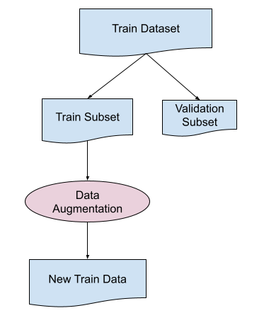

# Textual Entailment Recognition in Multilingual Text using Transfer Learning and Data Augmentation 

Kaggle has initiated a competition, [Contradictory, My Dear Watson](https://www.kaggle.com/c/contradictory-my-dear-watson/overview), to challenge machine learning practitioners to build a system that automatically classifies how pairs of sentences are related from texts in 15 diverse and under-represented languages. The aim of this capstone project is to create a multi-class classification system to detect entailment and contradiction in multi-lingual text using transfer learning and data augmentation. 

The final model yields an accuracy of 94% on the test dataset with a top 3% ranking on the [leaderboard](https://www.kaggle.com/competitions/contradictory-my-dear-watson/leaderboard#) at the time of the competition.

The final report with model visualizations and validation plots can be accessed [here](https://github.com/wchowdhu/udacity-capstone-project/blob/main/report/report.pdf).

For a beginner's tutorial on implementing a baseline model for textual entailment recognition, use this [notebook](https://www.kaggle.com/code/wchowdhu/classify-textual-entailment-using-tensorflow).

## Dependencies

The project requires Python 3.6 and the latest version of the following libraries installed:  
  - [numpy](https://numpy.org/)
  - [pandas](https://pandas.pydata.org/)
  - [scikit-learn](https://scikit-learn.org/stable/)
  - [transformers](https://huggingface.co/transformers/)
  - [allennlp](https://github.com/allenai/allennlp)
  - [googletrans](https://pypi.org/project/googletrans/)
  - [datasets](https://github.com/huggingface/datasets)
  - [PyTorch](https://pytorch.org/)
  - [tensorflow](https://www.tensorflow.org/install)
 
To train the models, Tensor Processing Units or TPUs with 8 cores were used. TPUs are hardware accelerators specialized in deep learning tasks and are available to use for free in Kaggle. All the implementations were performed in both Tensorflow and Pytorch frameworks with Python programming language.

## Data
The data files can be accessed from the `Data` folder. The following figure displays the data augmentation workflow used to improve model performance across all the languages and language families.

## Code

The `notebook` folder contains all the Jupyter notebook files consisting of the baselines, data augmentation, and fine tuning.
The `scripts` folder contains code to train the models.

## Run

Run the python files from `scripts` directory using the following command and adding the necessary argument values:

    python run.py --train-file data/train.csv --test-file data/test.csv --bt-file data/back_translation_all.csv

To open the .ipynb files in your browser and look at the output of the completed cells, use the following command in your terminal after changing the working directory to the project `directory textual-entailment-recognition/notebooks`:

    jupyter notebook <file_name>.ipynb

## Results

The performance of the trained models were evaluated across all the output classes, languages, and language families using a held-out subset. 
You can also check the [report](https://github.com/wchowdhu/udacity-capstone-project/blob/main/report/report.pdf) which contains an in-depth analysis.

 

